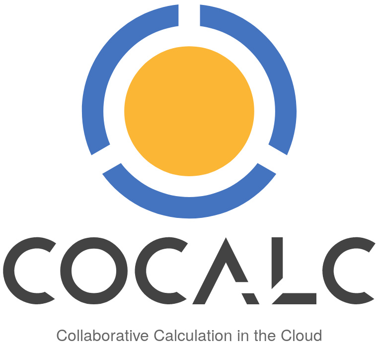

# Zpracování laboratorních měření v CoCalc
Tato dokumentace vznikla na základě podkladů bakalářské práce napsané pro Jihočeskou univerzitu v Českých Budějovicích. Jedná se o druhé přepracované vydání.

 
 

Cílem bylo představit potenciál webové služby CoCalc a naučit v ní pracovat především studenty vysokých škol, aby dosáhli lepších výsledků při zpracování laboratorních měření. Uvedené informace a postupy se však ohou aplikovat rovněž na dokumenty jiného zaměření. 

 
 

#### Dokumentace se věnuje:
- Seznámení se službou CoCalc
- Popisu práce v CoCalc
- Požadavkům na laboratorní protokol
- Typografickým pravidlům (všeobecně)
- Správnému zápisu fyzikálních jednotek
- Sázení matematických rovnic v jazyku Latex
- Zpracování naměřených hodnot
- Základům jazyka Octave

 
 

#### Obsah repozitáře:
- Dokumentace, která popopisuje zpracování lab. měření v CoCalc
- Originál (první verze) bakalářské práce

 
 

